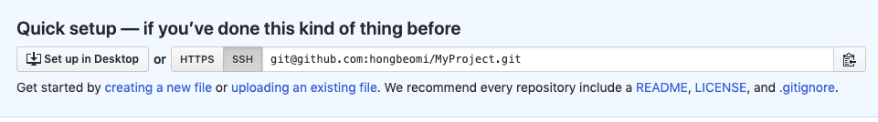

# Github 사용법
> GitHub 사용법과 Travis CI, Coveralls에 대해 알아본다.

 

<br>

## What?

깃은 프로젝트의 어떤 부분도 겹쳐쓰지 않게 프로젝트의 변경을 관리하는 버전관리 소프트웨어이다.

<br>

## Contents

* #### [Github](#github-시작하기)

* #### [Travis CI](#travis-ci-시작하기)

* #### [Coveralls](#coveralls-시작하기)

<br>

### github 시작하기

---

먼저 [Github.com](https://github.com/)에 가입한다. 그리고 자신의 운영체제에 따라서 윈도우, 맥, 리눅스 용 깃을 설치한다.

<br>

> #### 초기 설정 - 설치한 깃에 다음 코드를 타이핑한다.

```커맨드
유저 이름 설정 : git config --global user.name "Your Name"
유저 이메일 설정 : git config --global user.email "Your Email"
```

<br>

<br>

> #### 온라인 저장소 생성하기

깃허브에 접속 후 repository 탭에서 다음과 같이 new 버튼을 눌러서 새로운 리포지토리를 생성해준다.

<left></left>


리포지토리 이름과 간단한 설명을 name과 Description란에 써준 후 Create repository를 클릭한다. Public과 Private를 이용하여 비공개 설정을 할 수 있고 README 파일과 .gitignore, license에 대한 파일을 자동으로 만들 수도 있다. 

<br>

<br>

그리고 자신의 로컬 컴퓨터에서 깃허브에 있는 리포지토리와 연동할 저장소를 생성해준다.

``` 커맨드
로컬 저장소 생성 : mkdir MyProject
로컬 저장소로 이동 : cd MyProject
```

<br>

<br>

이제 현재 디렉토리를 깃 저장소라고 컴퓨터에게 알려주기 위해 초기화를 해준다. 이 명령어는 새로운 로컬 저장소를 생성할 때 처음에 반드시 해주어야 한다.

``` 커맨드
깃 초기화 : git init
```

<br>

<br>

간단하게 README 파일을 만들어서 리포지토리에 올려본다.

~~~ 커맨드
vi README.md
~~~

README 파일은 현재 리포지토리에 대한 설명이나 사용법을 적어주는 파일이다. 간단하게 작성한다.

<br>

<br>

Status 명령어를 통해서 현재 깃의 상태를 확인할 수도 있다.

~~~ 커맨드
상태 확인 : git status
~~~

<br>

<br>

이제 만든 README 파일을 올려본다.

~~~ 커맨드
변경된 파일을 추가한다. : git add .
특정 파일을 적어서 추가할 수도 있다. : git add README.md
~~~

<br>

<br>

add 명령어를 입력한 후에는 반드시 commit 명령어를 실행해주도록 한다.

~~~ command
코멘트 추가 : git commit -m "수정사항 입력"
~~~

<br>

<br>

> #### 로컬 저장소와 깃허브 리포지토리 저장소 연결하기

깃허브에서 새로운 리포지토리를 생성했을때 다음과 같은 화면을 볼 수 있다.

<left></left>
HTTPS와 SSH를 이용하여 연결할 수 있는데 HTTPS를 사용하여 연결하고 싶다면 HTTPS 버튼을 누른후 나오는 값을 복사하여 사용한다.

~~~커맨드
리포지토리 연결 : git remote add origin 값 붙혀넣기
리포지토리 연결 확인 : git remote -v
~~~

<br>

<br>

* SSH 키 사용하여 연결하기

  1. >  터미널에서 등록되어 있는 키를 확인하기

     ~~~ 커맨드
     ls -al ~/.ssh
     ~~~

     아무것도 나오지 않는다면 새로 만들어준다.

     

  2. >  ssh키 생성하기

     ~~~ 커맨드
     ssh-keygen -t rsa -C "깃허브 가입 이메일 주소 입력"
     ~~~

     Enter passphrase (empty for no passphrass):

     Enter same passphrase again:

     위 두 줄의 문자는 비밀번호를 입력하는 것인데 그냥 엔터를 누르면 비밀번호 없이 사용할 수 있다. (추천)

     

  3. >  깃허브에 키 등록하기

     깃허브에 들어가서 Settings —> SSH and GPG keys —> New SSH key 를 눌러서 

     ``` 커맨드
     vi ~/.ssh/id_rsa.pub 의 내용을 전부 복사해준다.
     ```

     복사한 내용을 깃허브의 Key란에 붙혀넣어주고 Title은 키 이름을 지어주고 Add SSH key 버튼을 눌러 생성해준다.

     

  4. >  SSH 키를 이용하여 리포지토리 연결하기

     위 그림에 있는 SSH 버튼을 눌러서 나온 값을 복사 한 후에 

      ~~~ command
     레포지토리 연결 : git remote add origin 값 복사하기
      ~~~

<br>

<br>

> #### 깃허브 원격 저장소로 변경사항을 push하기

~~~ 커맨드
git push -u origin master
~~~

<br>

<br>

> #### 이제 깃허브 저장소에 가서 잘 올라갔는지 확인해본다.

<br>

<br>

### Github — .gitignore 파일

---

> #### .gitignore 파일이란? 

* 깃허브에 파일을 올릴 때 깃허브 리포지토리에서 불필요한 파일을 볼 수 없게 해주는 파일이다.

<br>

<br>

> #### .gitignore 파일 생성하기

* [gitignore.io](https://www.gitignore.io/) 사이트에 접속 후 자신의 프로젝트에서 사용하는 개발 환경, 프로그래밍 언어, 운영체제를 추가하여 만들어 준다.

* 만들어진 값들을 전부 복사한다.

* 자신의 로컬 저장소에서 프로젝트 폴더로 이동하여 .gitignore 파일을 생성해준 후 붙혀넣어 준다.

  ~~~ 커맨드
  vi .gitignore
  ~~~

<br>

<br>

### Github — 뱃지 달기

---

> #### 깃허브 README.md 파일에 build나 coverage, 언어, 버전에 대한 뱃지를 달 수 있다.

[shields.io](https://shields.io/) 에 접속하여 나만의 뱃지를 만들어 첨부할 수 있다.

<br>

<br>

### Travis CI 시작하기

---

먼저 [Travis CI](https://travis-ci.org/) 에 깃허브 아이디로 간단하게 가입한다. 

Travis CI란 Github를 이용하여 프로젝트를 진행 할 때 사용하는 오픈소스 프로젝트이다. 이것을 사용하여 Git에 커밋이나 푸쉬를 할 때마다 자동으로 프로젝트에 대한 빌드나 테스트를 진행할 수 있다.

가입한 후에 Settings 에 들어가서 연동할 리포지토리를 선택해준다.

<br>

<br>

> #### Travis 설정하기

일단 .travis.yml 파일을 생성해준다. Travis CI를 이용하려면 Maven, Gradle, ANT 3개 중 하나의 빌드 도구를 선택해서 진행하여야 하는데 나는 Maven을 사용하여 진행하였다.

~~~ command
vi .travis.yml

## 예시 - java 파일 ##
jdk:
- oraclejdk8
# jdk 버전 설정
install:
- mvn install -DskipTests=true -Dmaven.javadoc.skip=true -B -V
# maven 이용
script:
- mvn test
~~~

<br>

<br>

> #### 프로젝트에 maven framework 연결하기 - 인텔리제이 기준

자신의 자바 프로젝트를 인텔리제이로 실행한 후에 

자신의 프로젝트 파일 우클릭 —> add framework support.. —> maven 추가

그러면 프로젝트에 pom.xml 파일이 생성된다. 그리고 groupId와 artifactId를 생성해주어야 하는데 패키지 이름과 프로젝트 이름을 각각 입력해준다.

<br>

<br>

> #### Travis CI 실행하기

위 절차를 마치고 Github에 커밋이나 푸쉬를 하게 되면 Travis 사이트에서 자동으로 변화를 인지하고 빌드를 실행하게 된다.

<left></left>
빌드에 성공한 화면이다. Build passing 뱃지를 클릭하여 README.md 파일에 추가하여 사용할 수 있다.

그리고 빌드하는 모습을 실시간으로 확인 할 수 있다.

<br>

<br>

### Coveralls 시작하기

---

> #### coverage란?

코드 커버리지는 소프트웨어의 테스트에 대해 말할 때 얼마나 테스트가 충분한가를 나타내는 것이다. 말 그대로 코드가 얼마나 커버되었는가를 나타낸다.

커버리지를 100퍼센트 채우기 위해서는 코드에 대한 테스트가 코드의 각 내부 조건에 대해 모두 성공해야 한다.

먼저 [coveralls.io](https://coveralls.io/) 사이트에 깃허브 아이디로 간단하게 가입한다. 그 후 add repo 탭에서 커버리지를 측정할 프로젝트를 선택하여 추가해준다.


> .coveralls.yml 파일 생성하기

coveralls 파일을 생성한 후에 coveralls.io 사이트에서 자신의 리포지토리를 클릭하면 

```
service_name: travis-pro
repo_token: *******************
```

다음과 같은 서비스 이름과 리포지토리 토큰을 볼 수 있는데 이를 복사한다.

<br>

<br>

그리고 .coveralls.yml 파일을 만들고 붙혀넣기 한다.

~~~command
vi .coveralls.yml
~~~

<br>

<br>

> IntelliJ 테스트 코드 만들기

인텔리제이에서 자신의 프로젝트를 실행시킨 후 TEST 코드를 생성한다.

테스트하고자 하는 클래스 혹은 메소드에 커서를 올려놓은 뒤 `command + shift + t` 를 누르면 새로운 테스트 코드를 만들 수 있다. testing library 는 junit4를 선택해주고 테스트를 실행할 메소드를 추가하고 ok를 누른다. 이 때 junit 모듈이 없다고 알림이 뜨면 fix 버튼이나 ok버튼을 눌러 추가해주면 된다.

- 간단하게 더하기를 실행하는 클래스와 메소드를 만들어 보았다.

  <left></left>

* 그리고 이에 대한 테스트 코드를 작성했다.

  <left></left>

위 테스트 코드에서 우클릭 후 Run '클래스 or 메소드 이름' with Coverage 를 클릭하여 coverage를 측정할 수 있다.

<br>

<br>

> IntelliJ에 maven 플러그인 연동하기

위에서 maven framework를 추가하는 방법을 알아보았는데 Travis CI에서 빌드 후 Coveralls 페이지로 테스트 결과를 전송하기 위해 pom.xml 파일에 다음을 추가해준다.

~~~ command
## maven plugins 및 properties 추가하기 ##
## 중간에 repoToken 유의할 것!! ##
    <build>
        <plugins>
            <plugin>
                <groupId>org.apache.maven.plugins</groupId>
                <artifactId>maven-compiler-plugin</artifactId>

                <configuration>
                    <source>1.8</source>
                    <target>1.8</target>
                    <encoding>utf-8</encoding>
                </configuration>
            </plugin>

            <plugin>
                <groupId>org.eluder.coveralls</groupId>
                <artifactId>coveralls-maven-plugin</artifactId>
                <version>4.3.0</version>
                <configuration>
                    <repoToken>자신의 리포지토리 토큰 입력</repoToken>
                    <sourceEncoding>utf-8</sourceEncoding>
                </configuration>
            </plugin>

            <plugin>

                <groupId>org.codehaus.mojo</groupId>
                <artifactId>cobertura-maven-plugin</artifactId>
                <version>2.7</version>
                <configuration>
                    <format>xml</format>
                    <maxmem>256m</maxmem>
                    <!-- aggregated reports for multi-module projects -->

                    <aggregate>true</aggregate>
                    <encoding>utf-8</encoding>
                    <check/>
                </configuration>
            </plugin>

        </plugins>
    </build>
    <dependencies>
        <dependency>
            <groupId>junit</groupId>
            <artifactId>junit</artifactId>
            <version>4.12</version>
            <scope>test</scope>
        </dependency>
    </dependencies>

    <properties>
        <project.build.sourceEncoding>utf-8</project.build.sourceEncoding>
    </properties>
~~~

위에 리포 토큰 태그 안에 .coveralls.yml 파일 안의 토큰을 추가해준다.

<br>

<br>

> Travis CI 빌드 및 Coverage 측정하기

위 와 같은 파일들을 전부 작성해주고 push를 해주면 알아서 트래비스에서 빌드 후 coveralls 사이트로 coverage 결과를 전송해준다.

밑에 사진은 성공한 화면이다.

<left></left>

<br>


> #### .coveralls.yml 파일과 pom.xml 파일안의 토큰을 숨기기

업데이트 예정

<br>

## Made By

- hongbeom ahn  - dks3963@naver.com

